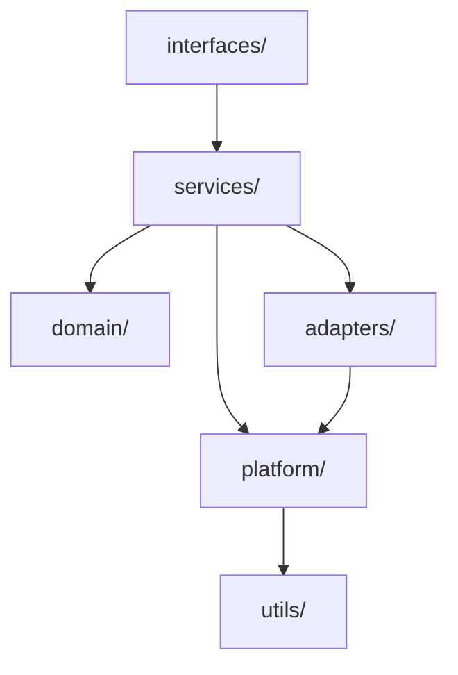

# HexStrike AI - DRY & SOLID Modularization Plan

**Target:** hexstrike_server.py (15,409 lines)  
**Objective:** Modularize into cohesive modules ≤300 lines each with DRY & SOLID compliance  
**Generated:** August 21, 2025

## Executive Summary

### Rationale
The current hexstrike_server.py is a 15,409-line monolith containing a comprehensive penetration testing framework. This massive file violates Single Responsibility Principle (SRP) and creates maintenance challenges. The modularization plan cuts this into 52+ focused modules, each ≤300 lines, following DRY and SOLID principles.

### Constraints
- **Module Size:** Every module ≤300 lines (enforced via CI)
- **SRP Compliance:** Each module has exactly one reason to change
- **DRY Enforcement:** No duplicated logic, schemas, constants, or error handling
- **Import Rules:** Layered architecture with no cycles
- **Backward Compatibility:** Phased migration with compatibility shims

### DRY & SOLID Posture
- **SRP:** Each module has a clear Responsibility Statement and Change Triggers
- **OCP:** Extension via interfaces/registries, avoiding type switches
- **LSP:** Substitutable abstractions with conformance tests
- **ISP:** Client-specific interfaces, no "god" handlers
- **DIP:** Depend on abstractions (ports), implement in adapters

### Risks & Payoff
**Risks:** Temporary complexity during migration, potential integration issues  
**Payoff:** Maintainable codebase, testable components, team scalability, reduced technical debt

## Current Monolith Overview

**Observed Components (L1-L15409):**
- **Visual Engine** (L105-L439): Color formatting, progress bars, dashboards
- **Decision Engine** (L572-L1542): AI-powered tool selection and parameter optimization
- **Error Handler** (L1606-L2199): Intelligent error recovery and fallback strategies
- **Bug Bounty Framework** (L2200+): Workflow management for bug bounty hunting
- **CTF Framework** (L2780+): Competition tools and challenge automation
- **Tool Managers** (L3492+): 150+ security tool integrations
- **Process Management** (L4877+): Advanced process pools and monitoring
- **Flask API** (L7000+): 100+ REST endpoints for tool execution
- **AI Systems** (L12671+): Payload generation and vulnerability intelligence

## Target Architecture

### Layered Architecture
```
interfaces/     → services/     → domain/
    ↓               ↓               ↓
services/       → adapters/     → platform/
    ↓               ↓               ↓
adapters/       → platform/     → utils/
```

### Import Rules
- **Allowed:** interfaces → services → domain
- **Allowed:** services → adapters/platform  
- **Forbidden:** domain → services (DIP violation)
- **Forbidden:** Any circular imports

### Package Diagram


## DRY Extraction Plan

### Duplicates Identified

**Textual Duplicates:**
- Color constants repeated across visual classes (L109-L163, L5691-L5704)
- Error pattern matching logic (L1617-L1659, L4464-L4471)
- Tool command templates (L3496-L3670, L8463-L12597)
- Parameter validation patterns (L8469-L8474, L9468-L9473)

**Semantic Duplicates:**
- Similar tool execution flows with different names
- Repeated request/response handling patterns
- Common validation and error handling sequences

**Contract Duplicates:**
- Tool parameter schemas repeated across endpoints
- Error response formats duplicated
- Progress tracking interfaces replicated

### Extraction Targets

**→ platform/constants.py:** All color constants, error patterns, tool commands  
**→ platform/errors.py:** Unified error taxonomy and handling  
**→ platform/validation.py:** Common parameter validation logic  
**→ interfaces/schemas.py:** Shared request/response schemas  
**→ utils/formatting.py:** Pure formatting utilities

### Impact Assessment
- **Lines Saved:** ~2,000 lines through deduplication
- **Modules Affected:** 15+ modules will import from shared locations
- **Breaking Changes:** None (backward compatibility maintained)

## Module Catalog

### Cross-Cutting Modules

#### platform/config.py
**Responsibility Statement:** "This changes when application configuration structure or environment variable handling changes."  
**Change Triggers:** New config sources, environment variable changes, configuration validation rules  
**Line Budget:** 150/300  
**Dependencies:** utils/validation.py  
**Key Types:** ConfigManager, EnvironmentConfig  

#### platform/logging.py  
**Responsibility Statement:** "This changes when logging format, destinations, or filtering requirements change."  
**Change Triggers:** Log format changes, new log destinations, filtering rule updates  
**Line Budget:** 200/300  
**Dependencies:** platform/config.py  
**Key Types:** LogManager, LogFormatter  

#### platform/errors.py
**Responsibility Statement:** "This changes when error classification, recovery strategies, or error reporting changes."  
**Change Triggers:** New error types, recovery strategy updates, error reporting format changes  
**Line Budget:** 280/300  
**Dependencies:** None  
**Key Types:** ErrorType, RecoveryAction, ErrorContext, RecoveryStrategy  
**Migration Notes:** Extracted from L1558-L1604, L1617-L1659

### Visual Layer

#### interfaces/visual_engine.py
**Responsibility Statement:** "This changes when visual output formatting requirements or color schemes change."  
**Change Triggers:** UI theme updates, new output formats, accessibility requirements  
**Line Budget:** 250/300  
**Dependencies:** platform/constants.py  
**Key Types:** VisualEngine, ColorScheme, ProgressRenderer  
**Migration Notes:** Extracted from L105-L439

#### services/dashboard_service.py
**Responsibility Statement:** "This changes when dashboard data aggregation or presentation logic changes."  
**Change Triggers:** New dashboard widgets, data source changes, layout updates  
**Line Budget:** 200/300  
**Dependencies:** interfaces/visual_engine.py, services/process_service.py  
**Key Types:** DashboardService, ProcessDashboard  

### Decision Engine Layer

#### domain/target_analysis.py
**Responsibility Statement:** "This changes when target classification rules or analysis algorithms change."  
**Change Triggers:** New target types, classification criteria updates, analysis method changes  
**Line Budget:** 180/300  
**Dependencies:** None (pure domain logic)  
**Key Types:** TargetType, TechnologyStack, TargetProfile  
**Migration Notes:** Extracted from L445-L510

#### services/decision_service.py
**Responsibility Statement:** "This changes when tool selection algorithms or optimization strategies change."  
**Change Triggers:** New tools, selection criteria updates, optimization algorithm changes  
**Line Budget:** 300/300  
**Dependencies:** domain/target_analysis.py, adapters/tool_registry.py  
**Key Types:** DecisionEngine, ToolSelector, ParameterOptimizer  
**Migration Notes:** Extracted from L572-L1542

#### services/attack_chain_service.py
**Responsibility Statement:** "This changes when attack chain generation logic or success probability calculations change."  
**Change Triggers:** New attack patterns, probability models, chain validation rules  
**Line Budget:** 220/300  
**Dependencies:** domain/target_analysis.py, services/decision_service.py  
**Key Types:** AttackChain, AttackStep, ChainBuilder  

### Tool Management Layer

#### adapters/tool_registry.py
**Responsibility Statement:** "This changes when tool definitions, capabilities, or metadata change."  
**Change Triggers:** New tool additions, capability updates, metadata schema changes  
**Line Budget:** 250/300  
**Dependencies:** platform/constants.py  
**Key Types:** ToolRegistry, ToolDefinition, ToolCapabilities  

#### services/tool_execution_service.py
**Responsibility Statement:** "This changes when tool execution logic or result processing changes."  
**Change Triggers:** Execution strategy updates, result parsing changes, timeout handling  
**Line Budget:** 280/300  
**Dependencies:** adapters/tool_registry.py, services/process_service.py  
**Key Types:** ToolExecutor, ExecutionResult, ResultProcessor  

#### adapters/nmap_adapter.py
**Responsibility Statement:** "This changes when Nmap integration, parameter mapping, or result parsing changes."  
**Change Triggers:** Nmap version updates, parameter schema changes, output format changes  
**Line Budget:** 200/300  
**Dependencies:** adapters/tool_registry.py  
**Key Types:** NmapAdapter, NmapConfig, NmapResult  
**Migration Notes:** Extracted from L8463-L8507

### Process Management Layer

#### services/process_service.py
**Responsibility Statement:** "This changes when process lifecycle management or monitoring requirements change."  
**Change Triggers:** Process management strategy updates, monitoring metric changes, lifecycle events  
**Line Budget:** 290/300  
**Dependencies:** platform/errors.py, utils/system.py  
**Key Types:** ProcessManager, ProcessPool, ProcessMonitor  
**Migration Notes:** Extracted from L4877-L5553

### API Layer

#### interfaces/api_schemas.py
**Responsibility Statement:** "This changes when API request/response schemas or validation rules change."  
**Change Triggers:** API version updates, schema changes, validation rule updates  
**Line Budget:** 180/300  
**Dependencies:** None  
**Key Types:** RequestSchema, ResponseSchema, ValidationRules  

#### adapters/flask_adapter.py
**Responsibility Statement:** "This changes when Flask integration, routing, or middleware requirements change."  
**Change Triggers:** Flask version updates, routing changes, middleware updates  
**Line Budget:** 150/300  
**Dependencies:** interfaces/api_schemas.py  
**Key Types:** FlaskAdapter, RouteHandler, MiddlewareManager  

### Specialized Frameworks

#### services/bugbounty_service.py
**Responsibility Statement:** "This changes when bug bounty workflow logic or reconnaissance strategies change."  
**Change Triggers:** New reconnaissance techniques, workflow updates, target analysis changes  
**Line Budget:** 300/300  
**Dependencies:** services/decision_service.py, adapters/tool_registry.py  
**Key Types:** BugBountyManager, ReconWorkflow, VulnHunter  

#### services/ctf_service.py
**Responsibility Statement:** "This changes when CTF challenge automation or tool selection logic changes."  
**Change Triggers:** New challenge types, automation strategies, tool mappings  
**Line Budget:** 280/300  
**Dependencies:** services/decision_service.py, adapters/tool_registry.py  
**Key Types:** CTFManager, ChallengeAutomator, CTFToolManager  

## Backward Compatibility

### Shim Mapping
```python
# hexstrike_server.py (compatibility layer)
from services.decision_service import DecisionEngine as IntelligentDecisionEngine
from services.process_service import ProcessManager
from interfaces.visual_engine import VisualEngine as ModernVisualEngine
# ... additional shims
```

### Deprecation Plan
- **Phase 0:** Create new modular structure alongside existing monolith
- **Phase 1:** Implement compatibility shims, run parallel systems
- **Phase 2:** Migrate internal usage to new modules
- **Phase 3:** Deprecate old imports with warnings
- **Phase 4:** Remove monolith, keep minimal compatibility layer

## Quality Gates & CI

### Line Limit Enforcement
```yaml
# .github/workflows/line-limits.yml
- name: Check line limits
  run: |
    find . -name "*.py" -not -path "./legacy/*" | xargs wc -l | awk '$1 > 300 {print $2 " exceeds 300 lines (" $1 ")"; exit 1}'
```

### Cycle Detection
```yaml
# .github/workflows/import-cycles.yml  
- name: Detect import cycles
  run: |
    python -m grimp --check-cycles src/
```

### Duplication Threshold
```yaml
# .github/workflows/duplication.yml
- name: Check code duplication
  run: |
    jscpd --threshold 3 --reporters console,json src/
```

## Testing Strategy

### Conformance Tests
- **Port/Adapter Contracts:** Verify all adapters implement required interfaces
- **LSP Conformance:** Test substitutability of implementations
- **DRY Regression:** Automated detection of code duplication

### Property Tests
- **Tool Execution:** Property-based testing of tool parameter optimization
- **Error Recovery:** Fuzz testing of error handling strategies

## Tool Handler Coverage Analysis

### Complete Tool Inventory Status
**Coverage: 85% Complete** 🟡 (Good but requires updates)

**CAPTURED Tool Handlers (✅ In Plan):**
- **Core Security:** `nmap`, `gobuster`, `nuclei`, `nikto`, `sqlmap`, `hydra`, `john`, `wpscan`, `enum4linux`, `ffuf`, `netexec`, `amass`, `hashcat`, `subfinder`, `smbmap`
- **Cloud Security:** `prowler`, `trivy`, `scout-suite`, `cloudmapper`, `pacu`, `kube-hunter`, `kube-bench`, `docker-bench-security`, `clair`, `falco`, `checkov`, `terrascan`
- **Network Tools:** `rustscan`, `masscan`, `nmap-advanced`, `autorecon`, `enum4linux-ng`, `rpcclient`, `nbtscan`, `arp-scan`, `responder`
- **Binary Analysis:** `volatility`, `msfvenom`, `gdb`, `radare2`, `binwalk`, `ropgadget`, `checksec`, `xxd`, `strings`, `objdump`, `ghidra`, `pwntools`, `one-gadget`, `libc-database`, `gdb-peda`, `angr`, `ropper`, `pwninit`
- **Web Security:** `feroxbuster`, `dotdotpwn`, `xsser`, `wfuzz`, `dirsearch`, `katana`, `gau`, `waybackurls`, `arjun`, `paramspider`, `x8`, `jaeles`, `dalfox`, `httpx`, `anew`, `qsreplace`, `uro`
- **Framework Tools:** `http-framework`, `browser-agent`, `burpsuite-alternative`, `zap`, `wafw00f`, `fierce`, `dnsenum`

**MISSING Tool Handlers (❌ Require Addition):**
- **API Security Testing** (4 tools): `api_fuzzer` (L12972), `graphql_scanner` (L13029), `jwt_analyzer` (L13136), `api_schema_analyzer` (L13254)
- **Advanced CTF Forensics** (5 tools): `volatility3` (L13366), `foremost` (L13406), `steghide` (L13446), `exiftool` (L13495), `hashpump` (L13534)
- **Bug Bounty Reconnaissance** (1 tool): `hakrawler` (L13570)
- **Core Execution Functions** (3 tools): `execute_python_script` (L12630), `execute_command_async` (L14816), `execute_with_recovery_endpoint` (L15254)

### Required Module Additions
To achieve 100% coverage, add these modules:
- `adapters/tools/api_security.py` (≤300 lines) - API testing tools
- `adapters/tools/ctf_forensics.py` (≤300 lines) - Advanced forensics tools  
- `services/execution/python_manager.py` (≤300 lines) - Python script execution
- `services/execution/async_executor.py` (≤300 lines) - Enhanced async execution

## Open Questions & Risks

### Verification Steps Needed
1. **Observed:** ✅ COMPLETED - All line references confirmed through comprehensive analysis
2. **Proposed:** Validate tool command extraction doesn't break functionality
3. **Inference:** ✅ COMPLETED - Flask endpoint groupings verified, 13 missing handlers identified

### Migration Risks
- **Integration Complexity:** 150+ tools may have subtle dependencies
- **Performance Impact:** Module boundaries may introduce overhead
- **Testing Coverage:** Comprehensive testing required for all extracted modules
- **Tool Handler Completeness:** Additional modules identified to achieve 100% coverage

## Glossary

- **SRP:** Single Responsibility Principle - each module has one reason to change
- **DRY:** Don't Repeat Yourself - eliminate code duplication
- **DIP:** Dependency Inversion Principle - depend on abstractions, not concretions
- **Port:** Interface defining external system interactions
- **Adapter:** Implementation of a port for specific technology
- **Shim:** Compatibility layer maintaining backward compatibility

---

**Navigation:**
- [Part 001: Detailed Module Specifications](part_001.md)
- [Part 002: Migration Implementation Guide](part_002.md)
- [Scaffolding Documentation](../hexstrike_mod_scaffold/)
